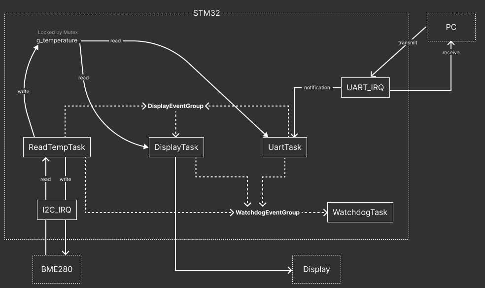
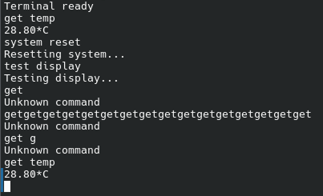

# baremetal-stm-temperaturesystem

## System overview
After RTOS scheduler start, system is reading temperature from BME280 sensor every second. DisplayTask fetches temperature value and shows it on the 8-segment display. In the meantime, UART task is waiting for user command and taking appropriate action based on the input. If all tasks are reporting every 3s independent watchdog is being fed by WatchdogTask.

## Architecture and data flow

## RTOS Task Structures
### Read Temperature Task (Priority: 2)
Task is executing instructions and going to sleep for 950ms
- Check if sensor is alive by reading sensor's ID register
- Raise flag in WatchdogEventGroup to indicate that task is working
- Read temperature from sensor registers 
- Write temperature to global variable protected by mutex
- Go to sleep for 950ms
### Display Task (Priority: 1)
Every cycle goes like so:
- Raise flag in WatchdogEventGroup to indicate that task is working
- Poll flags in DisplayEventGroup to see which actions are needed and clear them
- Conditional: Read new temperature value from global variable
- Conditional: Execute test of display
- Display current temperature on segment display
### Uart Task (Priority: 3)
Task is waking up on notification from UART_IRQ or every 1 second
- Raise flag in WatchdogEventGroup
- Wait for notification for 1 second
- If there is notification:
    - Clear respondText buffer
    - Take characters from uart buffer and store it in command buffer
    - Parse command to see if it matches any pre-defined command
    - Based on result of parsing execute one of actions:
        - Send temperature value
        - Raise flag in DisplayEventGroup to execute test of display
        - Execute MCU reboot
        - Give feedback that given command is unknown
### Watchdog Task (Priority: 4)
- Wait for bits in WatchdogEventGroup
- If all flags are raised:
    - Feed IWDG

### UART CLI:
| Command | Description | Expected Output / Action |
| :--- | :--- | :--- |
| `get temp` | Reads the currently stored temperature value. | `28.43*C` |
| `system reset` | Triggers a software reset of the microcontroller. | `Resetting system...` (followed by MCU reboot) |
| `test display` | Executes a hardware test by cycling through all segments, and digits | `Testing display...` (followed by start of display test procedure) |

## UART Terminal output

## Pinout table
Since the project is implemented on the STM32L476RG board, the components are wired directly to the MCU extension headers according to the following layout:

| Component / Function | Peripheral Signal | STM32 Pin | Port / Pin Number | Description |
| :--- | :--- | :--- | :--- | :--- |
| **BME280 Sensor** | I2C1_SCL | **PB8** | Port B, Pin 8 | I2C Clock Line (with external/internal pull-up) |
| **BME280 Sensor** | I2C1_SDA | **PB9** | Port B, Pin 9 | I2C Data Line (with external/internal pull-up) |
| **PC Serial Terminal** | USART2_TX | **PA2** | Port A, Pin 2 | ST-Link Virtual COM Port (Transmit) |
| **PC Serial Terminal** | USART2_RX | **PA3** | Port A, Pin 3 | ST-Link Virtual COM Port (Receive) |
| **8-Segment Display** | DIG_1 | **PC0** | Port C, Pin 0 | Digit 1 Common Cathode / Anode Control |
| **8-Segment Display** | DIG_2 | **PC1** | Port C, Pin 1 | Digit 2 Common Cathode / Anode Control |
| **8-Segment Display** | DIG_3 | **PC2** | Port C, Pin 2 | Digit 3 Common Cathode / Anode Control |
| **8-Segment Display** | DIG_4 | **PC3** | Port C, Pin 3 | Digit 4 Common Cathode / Anode Control |
| **8-Segment Display** | SEG_A | **PC4** | Port C, Pin 4 | LED Segment A Control |
| **8-Segment Display** | SEG_B | **PC5** | Port C, Pin 5 | LED Segment B Control |
| **8-Segment Display** | SEG_C | **PC6** | Port C, Pin 6 | LED Segment C Control |
| **8-Segment Display** | SEG_D | **PC7** | Port C, Pin 7 | LED Segment D Control |
| **8-Segment Display** | SEG_E | **PC8** | Port C, Pin 8 | LED Segment E Control |
| **8-Segment Display** | SEG_F | **PC9** | Port C, Pin 9 | LED Segment F Control |
| **8-Segment Display** | SEG_G | **PC10** | Port C, Pin 10 | LED Segment G Control |
| **8-Segment Display** | SEG_DP | **PC11** | Port C, Pin 11 | LED Segment Decimal Point Control |\
\
Software was verified on hardware. [You can see photo of working hardware here.](docs_att/hardware.jpeg)